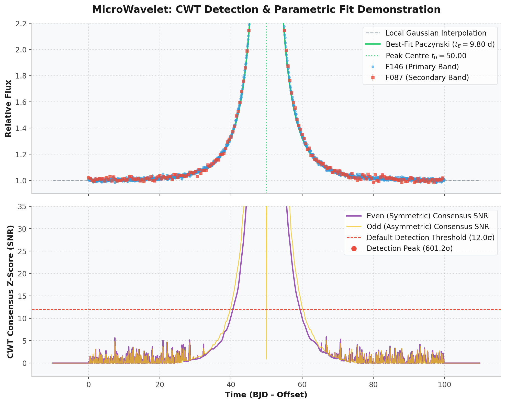
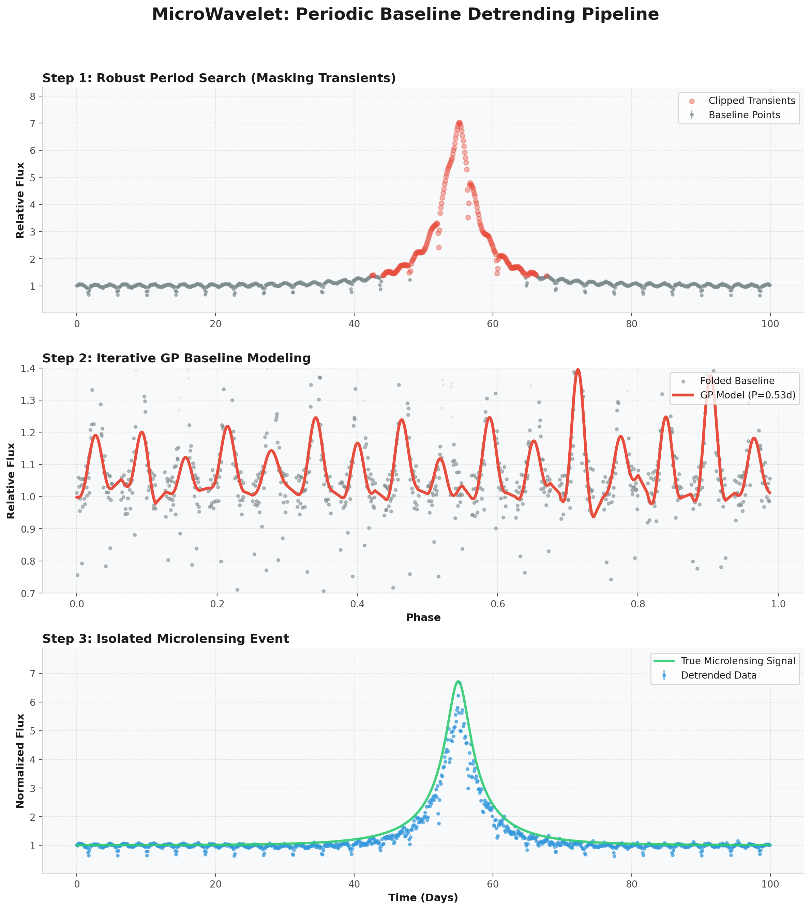

# MicroWavelet

<!-- zenodo-doi-badge -->
DOI: pending Zenodo release
<!-- /zenodo-doi-badge -->

`MicroWavelet` is a Python library for the detection of transient anomalies in multi-filter light curves using Continuous Wavelet Transform (CWT) methodologies. The package is optimized for microlensing signals but is applicable to general peak and dip detection in time-series data.

The library implements a scale-space search using Paczynski-profile wavelet kernels, integrated with robust Whittaker-Eilers (Smoothing Spline) detrending and multi-band chromaticity analysis.

## Mathematical Framework

### 1. Continuous Wavelet Transform (CWT)

The library computes the CWT coefficients $W(s, \tau)$ by convolving the light curve flux $f(t)$ with a scaled and translated mother wavelet $\psi(t)$:

$$W(s, \tau) = \int_{-\infty}^{\infty} f(t) \frac{1}{s^p} \psi^*\left(\frac{t - \tau}{s}\right) dt$$

To achieve scale-invariance for the Paczynski profile, we implement a modified normalization where $p=1$ in the kernel construction and apply an $s^{-0.5}$ correction to the resulting coefficients.

### 2. Paczynski Kernels

The wavelet kernels are derived from the Paczynski magnification formula, which describes the flux excess $A(u) - 1$ for a point-source point-lens microlensing event:

$$A(u) = \frac{u^2 + 2}{u \sqrt{u^2 + 4}}, \quad u(t) = \sqrt{u_0^2 + \left(\frac{t - t_0}{t_E}\right)^2}$$

The library utilizes two distinct kernel morphologies for anomaly detection:
*   **Even (Symmetric) Kernel ($\psi_e$):** Proportional to the negative second derivative of the magnification profile ($-\frac{d^2A}{dt^2}$). This kernel is optimized for detecting symmetric peaks and dips.
*   **Odd (Asymmetric) Kernel ($\psi_o$):** Proportional to the first derivative of the magnification profile ($\frac{dA}{dt}$). This kernel serves as a diagnostic for asymmetric features and caustic crossings.

Both kernels are L1-normalized such that $\sum |\psi| = 1$, ensuring that the resulting Z-scores (SNR) are comparable across the Einstein timescale grid $t_E$.

---

## Methodological Implementation

### 1. Scale-Invariant Wavelet Normalization

The library utilizes L1-normalized kernels to ensure scale independence. For Paczynski templates, we apply an $s^{-0.5}$ scaling to the CWT coefficients to align the peak detection scale $t_{E,\text{scan}}$ with the physical Einstein crossing time, independent of the background noise power spectrum.

### 2. Systematic Bias Correction

Signal detection is performed using a template impact parameter of $u_0 = 0.05$. To account for the timescale inflation observed in events with larger $u_0$, a 5th-degree polynomial correction is applied:

$$r_{\text{peak}}(u_0) \approx 12.0707 u_0^5 - 29.2612 u_0^4 + 28.1550 u_0^3 - 18.9146 u_0^2 + 22.2832 u_0 - 0.0635$$

The estimated crossing time is then refined as $t_{E,\text{true}} = t_{E,\text{scan}} / r_{\text{peak}}(u_{0,\text{event}})$, maintaining estimation residuals below 2% across the parameter space.

### 3. Parametric Statistical Evaluation

For each candidate detection, the library performs a weighted linear least-squares fit of the Paczynski model ($y = F_s S + F_b$) within a local $t_0 \pm 5 t_E$ window. Test statistics provided include:
- $\Delta\chi^2 = \chi^2_{\text{null}} - \chi^2_{\text{lens}}$
- $\Delta\text{BIC} = \chi^2_{\text{lens}} - \chi^2_{\text{null}} + 2 \ln(N)$

### 4. Boundary and Artifact Mitigation

- **Temporal Boundaries**: Detections within $0.5 \cdot t_E$ of the observation limits are identified via an `edge_flag` to distinguish them from potential windowing artifacts.
- **Interpolation**: A Nadaraya-Watson local Gaussian kernel regression (weighted by $1/\sigma^2$) is available to minimize the impact of non-uniform sampling and outliers.

### 5. Multi-Band Chromaticity Analysis

The primary band signal is projected onto secondary filters using a local weighted linear fit. The resulting `chromaticity_ratio` ($\mathcal{R} = F_{s,\text{other}} / F_{s,\text{primary}}$) and `chromatic_flag` facilitate the identification of non-achromatic signals, such as stellar flares or instrumental systematic effects.

### 6. Periodic Baseline Detrending

For observations of variable stars (e.g., RR Lyrae, eclipsing binaries), the library provides a highly optimized, multi-stage Whittaker-Eilers (Smoothing Spline) detrending pipeline:
1.  **Robust Period Search**: Performs an initial Lomb-Scargle search on a "cleaned" version of the light curve where large positive transients (like microlensing events) are masked using a 2.5-sigma MAD threshold.
2.  **Bayesian Period Selection**: Implements an iterative halving strategy to find the fundamental period. Candidates ($P/2, P, 2P$) are evaluated using a binned **Gaussian Log-Likelihood** proxy:

    $$\ln L = -0.5 \left( RSS + \sum_{k \in \text{valid}} \ln(2\pi \sigma_k^2) \right)$$
    
    This incorporates a sum-of-log-variances term that mirrors the noise determinant of Gaussian Processes to penalize poorly-folded periods (which exhibit high phase scatter and large bin errors $\sigma_k$) without complexity-penalty bias.
4.  **Iterative Whittaker Optimization**: The period is fine-tuned using a non-linear scalar optimizer that fits a robust Whittaker-Eilers smoother with circular boundary conditions and Generalized Cross-Validation (GCV) optimal smoothing parameter $\lambda$ selection at each iteration.
5.  **Normalization**: The raw flux is divided by the converged periodic Whittaker baseline model to isolate the stationary transient signal for CWT analysis.

---

## Installation

### From PyPI (Standard)
You can install the stable release of `microwavelet` directly from PyPI:
```bash
pip install microwavelet
```

### From Source (Local Development)

Clone the repository and install in editable mode:
```bash
git clone https://github.com/dylannpaterson/MicroWavelet.git
cd MicroWavelet
pip install -e ".[dev]"
```

---

## Usage Example

```python
import numpy as np
from microwavelet import analyze_lightcurve

# 1. Input data structure (multi-band relative flux)
data = {
    "F146": {
        "t": np.arange(0, 100, 0.1),
        "y": np.random.normal(1.0, 0.02, 1000),
        "y_err": np.ones(1000) * 0.02
    },
    "F087": {
        "t": np.arange(0, 100, 0.5),
        "y": np.random.normal(1.0, 0.03, 200),
        "y_err": np.ones(200) * 0.03
    }
}

# 2. Execute analysis pipeline with periodic detrending enabled
results = analyze_lightcurve(
    data,
    detrend_periodic=True,    # Enable baseline removal
    min_period=1.0,
    max_period=10.0,
    interpolator="weighted",
    cwt_threshold=12.0,
    stamp_dir="plots/"        # Optional: Save a detailed stamp plot of all peaks
)

# 3. Access detection parameters
for anomaly in results["anomalies"]:
    print(f"Candidate t0: {anomaly['t0']:.3f}")
    print(f"Timescale tE: {anomaly['tE']:.2f} (u0: {anomaly['u0']:.3f})")
```

---

## Pipeline Diagnostics

### Detection & Parametric Fit
The following plot illustrates the CWT detection process and subsequent parametric fit on a synthetic dataset:



*   **Top Panel**: Observed flux across multiple bands with the error-weighted Gaussian interpolation and the analytical Paczynski fit.
*   **Bottom Panel**: Scale-space consensus SNR for symmetric (even) and asymmetric (odd) morphologies relative to the detection threshold.

### Periodic Baseline Removal
For variable sources, the iterative Whittaker detrending pipeline isolates the periodic modulation to recover the underlying transient signal:



*   **Step 1: Robust Period Search**: Raw data with identified transient points highlighted.
*   **Step 2: Whittaker Modeling**: The converged baseline model in phase-folded space.
*   **Step 3: Recovered Signal**: The final detrended light curve with the isolated microlensing event.

---

## Verification

The core logic and timescale estimation accuracy can be verified using the provided test scripts:

```bash
python -m pytest
python -m ruff check --fix .
python -m ruff format .
```

---

## Requirements

- Python >= 3.9
- numpy
- scipy
- pandas
- astropy
- scikit-learn

## Contributing

Contributions should be made from a fork via pull request. Before opening a pull request, install the development extras and run the test and lint checks:

```bash
python -m pip install -e ".[dev]"
python -m pytest
python -m ruff check --fix .
python -m ruff format .
```

## Attributing

If you use MicroWavelet in published work, cite the archived release DOI listed above or use the repository citation metadata in `CITATION.cff`.

## Maintainer Release Notes

Release and workflow instructions are documented in `docs/RELEASE.md`.
